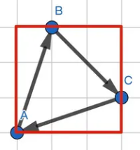
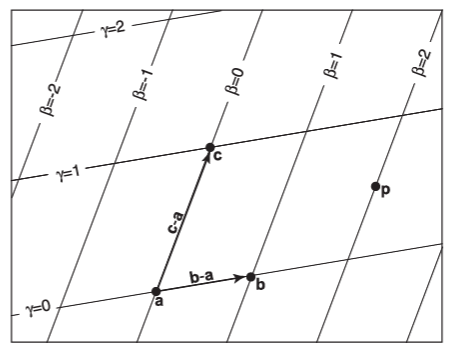
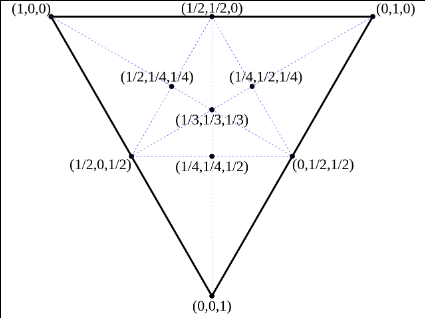
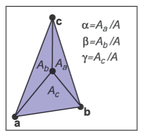
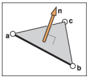

## 求解绘制三角形问题

绘制三角形就是遍历每一个像素，然后，判断这个像素是否在三角形内部。

但是万一，三角形很小，而屏幕很大，遍历每一个像素显然是非常低效的，在正式遍历前可以求出 `Bounding Rect` 来缩小范围：



```cpp
// Bounding Rect
Vector2i min(0, 0);
Vector2i max(width - 1, height - 1);
min.x = std::max(min.x, std::min(p0.x, std::min(p1.x, p2.x)));
min.y = std::max(min.y, std::min(p0.y, std::min(p1.y, p2.y)));
max.x = std::min(max.x, std::max(p0.x, std::max(p1.x, p2.x)));
max.y = std::min(max.y, std::max(p0.y, std::max(p1.y, p2.y)));
```

判断一个点是否在三角形内部，有很多方法，这里主要介绍重心坐标，因为这是图形学非常重要的一个知识点，而且也能非常好地解决这个问题。

## 重心坐标（Barycentric Coordinate）的定义



假设平面上存在三角形的三个点 $a, b, c$，则平面上任意的点 $p$ 都可使用三角形的三个顶点表示：

$$
\begin{aligned}
p &= a+\beta(b-a)+\gamma(c-a)\cr
p &= (1-\beta-\gamma)a+\beta b+\gamma c
\end{aligned}
$$

令：

$$
\begin{aligned}
\alpha &= 1-\beta-\gamma
\end{aligned}
$$

- 当 $\alpha$、$\beta$、$\gamma$ 均大于 0 小于 1 时，$p$ 位于三角形内部
- 当 $\alpha$、$\beta$、$\gamma$ 中有一个分量等于 0 时，$p$ 在三角形边上
- 当 $\alpha$、$\beta$、$\gamma$ 中有两个变量等于 0 时，$p$ 在某个顶点上

以坐标形式表示：

$$
p = (\alpha, \beta, \gamma)
$$



## 重心坐标的计算

### 面积法



$$
\begin{aligned}
\alpha = \frac{A_a}{A_a+A_b+A_c} \cr
\beta = \frac{A_b}{A_a+A_b+A_c} \cr
\gamma = \frac{A_c}{A_a+A_b+A_c}
\end{aligned}
$$

求面积可以使用叉乘：

$$
\alpha = \frac{A_a}{A} = \frac{\vert (c-b) \times (c-p)\vert}{\vert (a-b) \times (a-c)\vert}
$$

但是求出来的 $\alpha$ 失去了方向性。我们可以通过点乘一个法线来解决这个问题：



$$
\alpha = \frac{((c-b) \times (p-b))\cdot n}{((b-a) \times (c-a))\cdot n}
$$

>这个等式之所以成立的关键是两个向量 $a$、$b$ 的点乘表达式为：
>$$a\cdot b = \vert a\vert\vert b\vert\cos\theta$$
>当它们相互垂直的时候，$\cos\theta = 1$，那么上面的表示式实际上可以被表达为：
>$$
>\alpha = \frac{\vert(c-b) \times (p-b)\vert \vert n\vert}{\vert(b-a) \times (c-a)\vert \vert n\vert} = \frac{\vert(c-b) \times (p-b)\vert}{\vert(b-a) \times (c-a)\vert}
>$$
>这个结果和之前的推导一样。

同时我们从叉乘的定义中得到 $n = ab \times ac$。

最终，我们得到了最终结果：

$$
\begin{aligned}
\alpha &= \frac{n_a \cdot n}{n\cdot n}\cr
\beta &= \frac{n_b \cdot n}{n\cdot n}\cr
\gamma &= \frac{n_c \cdot n}{n\cdot n}
\end{aligned}
$$

其中：

$$
\begin{aligned}
n_a &= (c-b) \times (p-b)\cr
n_b &= (a-c) \times (p-c)\cr
n_c &= (b-a) \times (p-a)
\end{aligned}
$$

### 代数法

把上一小节的公式，写成这样的形式：

$$
\beta(b-a)+\gamma(c-a)+(a-p)= 0
$$

分别带入 x 和 y，得到两个方程，求两个未知数：

$$
\begin{aligned}
(x_b - x_a)\beta+(x_c - x_a)\gamma+(x_a - x_p) &= 0\cr
(y_b - y_a)\beta+(y_c - y_a)\gamma+(y_a - y_p) &= 0
\end{aligned}
$$

最终的结果:

$$
\begin{aligned}
\gamma &= \frac{(y_a-y_b)x_p+(x_b-x_a)y_p+x_a y_b-x_b x_a}{(y_a-y_b)x_c+(x_a-x_b)y_c+x_a y_b-x_b x_a}\cr
\beta &= \frac{(y_a-y_c)x_p+(x_c-x_a)y_p+x_a y_c-x_c x_a}{(y_a-y_c)x_b+(x_c-x_a)y_b+x_a y_c-x_c x_a}\cr
\alpha &= 1-\gamma-\beta
\end{aligned}
$$

---

上面是标准的求法，还有一种捷径。

把上面两个方程变成矩阵形式：

$$
\begin{aligned}
\begin{bmatrix}
   x_b - x_a & x_c - x_a & x_a - x_p \cr
\end{bmatrix}
\begin{bmatrix}
   \beta \cr
   \gamma \cr
   1
\end{bmatrix} &=
0\cr
\begin{bmatrix}
   y_b - y_a & y_c - y_a & y_a - y_p\cr
\end{bmatrix}
\begin{bmatrix}
   \beta \cr
   \gamma \cr
   1
\end{bmatrix} &=
0
\end{aligned}
$$

说明向量 $\begin{bmatrix}x_b - x_a & x_c - x_a & x_a - x_p \end{bmatrix}$ 垂直于向量 $\begin{bmatrix}\beta &\gamma & 1\end{bmatrix}$，向量 $\begin{bmatrix}y_b - y_a & y_c - y_a & y_a - y_p \end{bmatrix}$ 垂直于向量 $\begin{bmatrix}\beta &\gamma & 1\end{bmatrix}$。

得到：

$$
\begin{bmatrix}
   x_b - x_a \cr x_c - x_a \cr x_a - x_p
\end{bmatrix}\times
\begin{bmatrix}
   y_b - y_a \cr y_c - y_a \cr y_a - y_p
\end{bmatrix}=
\begin{bmatrix}
   k\beta \cr
   k\gamma \cr
   k
\end{bmatrix}
$$

这是最快的重心计算法，它只使用了一个叉乘就解决了问题。

## 重心坐标代码实现

根据上面推导的公式，最终，代码实现：

```cpp
for (int y = min.y; y <= max.y; y++) {
   for (int x = min.x; x <= max.x; x++) {
      Vector3i vx(p1.x - p0.x, p2.x - p0.x, p0.x - x);
      Vector3i vy(p1.y - p0.y, p2.y - p0.y, p0.y - y);

      Vector3i u = vx.Cross(vy);

      if (std::abs(u.z) < 1) {
         continue;
      }

      Vector3f barycentric(1.f - (u.x + u.y) / (float)u.z,
                          u.x / (float)u.z, u.y / (float)u.z);
      if (barycentric.x > 0 && barycentric.x < 1 && barycentric.y > 0 &&
         barycentric.y < 1 && barycentric.z > 0 && barycentric.z < 1) {
         PutPixel(Vector2i(x, y), color);
      } 
   }
}
```

## 参考资料

- Fundamentals of Computer Graphics
- [三角形重心坐标](https://zhuanlan.zhihu.com/p/65495373)
