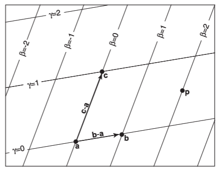
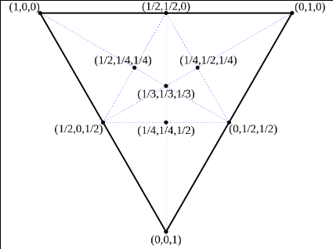
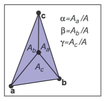

绘制三角形其实也有很多种不同的方法，但是这里主要介绍重心坐标，因为这是图形学非常重要的一个知识点，而且也能非常好地解决这个问题。

## 重心坐标（Barycentric Coordinate）的定义

假设平面上存在三角形的三个点 $A, B, C$，则平面上任意的点 $P$ 都可使用三角形的三个顶点表示：

$$
\begin{aligned}
P &= A+\beta(B-A)+\gamma(C-A)\cr
P &= (1-\beta-\gamma)A+\beta B+\gamma C
\end{aligned}
$$

令：

$$
\begin{aligned}
\alpha &= 1-\beta-\gamma
\end{aligned}
$$

- 当 $\alpha$、$\beta$、$\gamma$ 均大于 0 小于 1 时，$P$ 位于三角形内部
- 当 $\alpha$、$\beta$、$\gamma$ 中有一个分量等于 0 时，$P$ 在三角形边上
- 当 $\alpha$、$\beta$、$\gamma$ 中有两个变量等于 0 时，$P$ 在某个顶点上

以坐标形式表示：

$$
P = (\alpha, \beta, \gamma)
$$

## 重心坐标的计算

### 代数法

把上一小节的公式，写成这样的形式：

$$
P-A = \beta(B-A)+\gamma(C-A)
$$

变成矩阵形式：

$$
\begin{bmatrix}
   x_p - x_a \cr
   y_p - y_a
\end{bmatrix} =
\begin{bmatrix}
   x_b - x_a & x_c - x_a \cr
   y_b - y_a & y_c - y_a
\end{bmatrix}
\begin{bmatrix}
   \beta \cr
   \gamma
\end{bmatrix}
$$

## 面积法

$$
\begin{aligned}
\alpha = \frac{S_a}{S} \cr
\beta = \frac{S_b}{S} \cr
\gamma = \frac{S_c}{S}
\end{aligned}
$$

## 利用重心坐标绘制三角形
